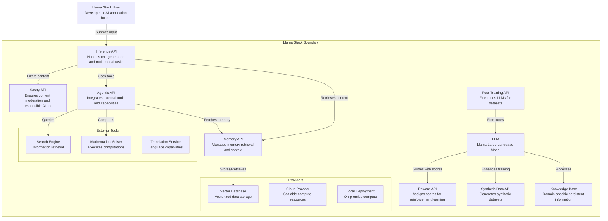

```mermaid
flowchart TD
    %% Title
    subgraph "Llama Stack Boundary"
        inferenceAPI["Inference API<br>Handles text generation and multi-modal tasks"]
        safetyAPI["Safety API<br>Ensures content moderation and responsible AI use"]
        memoryAPI["Memory API<br>Manages memory retrieval and context"]
        agenticAPI["Agentic API<br>Integrates external tools and capabilities"]
        postTrainingAPI["Post-Training API<br>Fine-tunes LLMs for datasets"]
        rewardAPI["Reward API<br>Assigns scores for reinforcement learning"]
        dataGenAPI["Synthetic Data API<br>Generates synthetic datasets"]
        knowledgeBase["Knowledge Base<br>Domain-specific persistent information"]
        llm["LLM<br>Llama Large Language Model"]

        subgraph "Providers"
            vectorDB["Vector Database<br>Vectorized data storage"]
            cloudProvider["Cloud Provider<br>Scalable compute resources"]
            localProvider["Local Deployment<br>On-premise compute"]
        end

        subgraph "External Tools"
            searchTool["Search Engine<br>Information retrieval"]
            mathTool["Mathematical Solver<br>Executes computations"]
            translationTool["Translation Service<br>Language capabilities"]
        end
    end

    %% User
    user["Llama Stack User<br>Developer or AI application builder"] -->|Submits input| inferenceAPI
    inferenceAPI -->|Filters content| safetyAPI
    inferenceAPI -->|Retrieves context| memoryAPI
    inferenceAPI -->|Uses tools| agenticAPI
    agenticAPI -->|Queries| searchTool
    agenticAPI -->|Computes| mathTool
    agenticAPI -->|Fetches memory| memoryAPI
    memoryAPI -->|Stores/Retrieves| vectorDB
    postTrainingAPI -->|Fine-tunes| llm
    llm -->|Guides with scores| rewardAPI
    llm -->|Enhances training| dataGenAPI
    llm -->|Accesses| knowledgeBase
```